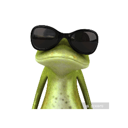

## Hola, me llamo Dani

  
  

Actualmente estoy estudiando **Desarrollo de Aplicaciones Web (DAW)** en 1º,
tras haber terminado el ciclo de **Sistemas Microinformáticos y Rede (SMR).

Me gusta mucho el mundo de la informática, el desarrollo y la tecnología, y quiero dedicarme a :
- Desarrollo web
- Mejorar mis habilidades en *Bases de datos*.
- Creación de aplicaciones modernas y escalables.

---

## Estoy aprendiendo...

- HTML, CSS, JavaScript
- Java y MySQL
- Github

---

## Meta a largo plazo

Quiero crecer como desarrollador y trabajar en proyectos importantes y que aporten valor, ya que siempre me ha gustado crear.

---

Este mi correo electrónico de contacto: dsanbue0806@educaand.es

Si no, siempre me encontrarán aquí.
