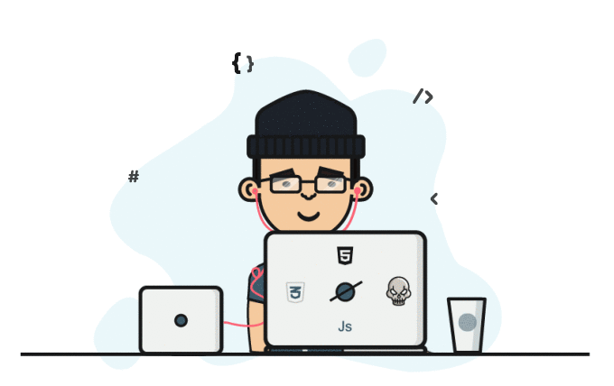

## Hola, me llamo Daniel 🫡🖖

  
  

<picture>
  <source media="(prefers-color-scheme: dark)" srcset="https://raw.githubusercontent.com/Santana-cmyk/Santana-cmyk/output/pacman-contribution-graph-dark.svg">
  <source media="(prefers-color-scheme: light)" srcset="https://raw.githubusercontent.com/Santana-cmyk/Santana-cmyk/output/pacman-contribution-graph.svg">
  
</picture>

Actualmente estoy estudiando **Desarrollo de Aplicaciones Web (DAW)** en 1º,
tras haber terminado el ciclo de **Sistemas Microinformáticos y Redes (SMR)**.

Me gusta mucho el mundo de la informática, el desarrollo y la tecnología, y quiero dedicarme a :

- Desarrollo web
- Mejorar mis habilidades en *Bases de datos*.
- Creación de aplicaciones
  
---

## Estoy aprendiendo...

- HTML, CSS, JavaScript

  
  
  

  
- Java y MySQL

  
  

  
- Github

  

---

## Meta a largo plazo

Quiero crecer como desarrollador y trabajar en proyectos importantes y que aporten valor, ya que siempre me ha gustado crear.

 
---

Este mi correo electrónico de contacto: indirana916@outlook.es

Si no, siempre me encontrarán aquí.
